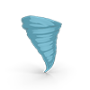

# WeatherScan 

> ### Hobby project built with Laravel to pull Environment Canada weather watches/warnings ATOM feed data into a local database and maintain a history of events, including Severe Thunderstorms, Warned Tornado Storms, Snowfall Warnings and more.

Please review the [CHANGELOG](https://github.com/Tychis/weatherscan/blob/master/CHANGELOG.md) for current changes and known issues. PRs, issues and feedback welcome!

# Getting Started

## Installation - Preparing the Framework

Please review Laravel's official installation guide for server requirements to ensure you meet the base requirements. An installer which automates these checks is planned in the future. [Laravel Installation Documentation](https://laravel.com/docs/7.x/installation)

For maximum functionality, this project requires [Redis](https://redis.io/), [Laravel Echo Server](https://github.com/tlaverdure/laravel-echo-server), and utilizes [Socket.IO](https://socket.io/). To have a quickstart on localhost, consider using [Laravel Homestead](https://laravel.com/docs/7.x/homestead) or a similar platform, which pre-installs Redis and NodeJS in the container.

Clone the repository

    git clone git@github.com:Tychis/weatherscan.git

**Note:** If you are installing this on an environment such as cPanel, you will need to move the contents of the folder _**public**_ to _**public_html**_.

Install the required dependencies using composer

    composer install

Copy .env.example and update your SQL configuration with your server's requirements. This will be streamlined in the future with an installer.

    cp .env.example .env

Generate your new application key to ensure a unique _**APP_KEY**_ is generated

    php artisan key:generate

Run the database migrations to generate the required database tables **after** setting your database configuration in _**.env**_

    php artisan migrate

Complete any additional steps as required for your web environment.

### Additional Steps (Optional)

If installing with intent to use the real-time sockets, you must also run the following commands from the project folder (NodeJS required):

    npm install

If using Laravel Homestead on Windows, please add **--no-bin-links** to your commands to avoid any issues with generating symlinks.    

When ready to start, run this command or add it to Supervisor:

    npx laravel-echo-server start

### Usage and Completing Installation

```
Usage: php artisan [command] [options]

Command: wscan:generateurls

Loop through the possible Environment Canada Alert ATOM feed URLs and confirm their existence. Add new items to the database as necessary.

Options:

  --province, -p [ISO_CODE]
    (OPTIONAL) Add the alerts for a single province by its ISO 3166-2:CA code. Running this command with multiple provinces will add additional provinces to scan. Leave blank to generate URLs for all provinces.  Acceptable options (case-insensitive): BC, AB, SK, MB, ON, QC, NB, NS, NL, PEI, NU, NT, YT
  --help, -h
    Show this help information.

Command: wscan:scanalerts

Loop through all collected ATOM feeds and update the database with current alert statuses. Will only add new entries on status change.

Options:

  --help, -h
    Show this help information.

Command: wscan:scanalerts

Truncate all ATOM feed URLs from the database in case you want a more restrictive set or need to regenerate the URLs for any reason.

Options:

  --help, -h
    Show this help information.

```

## Resolving Possible Issues

### Laravel-Echo-Server Installation

If you install Laravel Echo Server globally with NPM and still cannot launch the server with

    laravel-echo-server init

Change the command to:

    npx laravel-echo-server init

## Credits

[How to Use Laravel with Socket.IO](https://laravel-recipes.com/how-to-use-laravel-with-socket-io/)

## License

The Laravel framework is open-sourced software licensed under the [MIT license](https://opensource.org/licenses/MIT).
